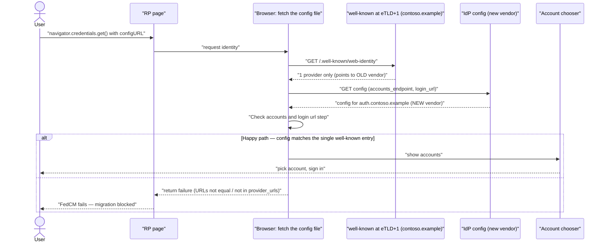
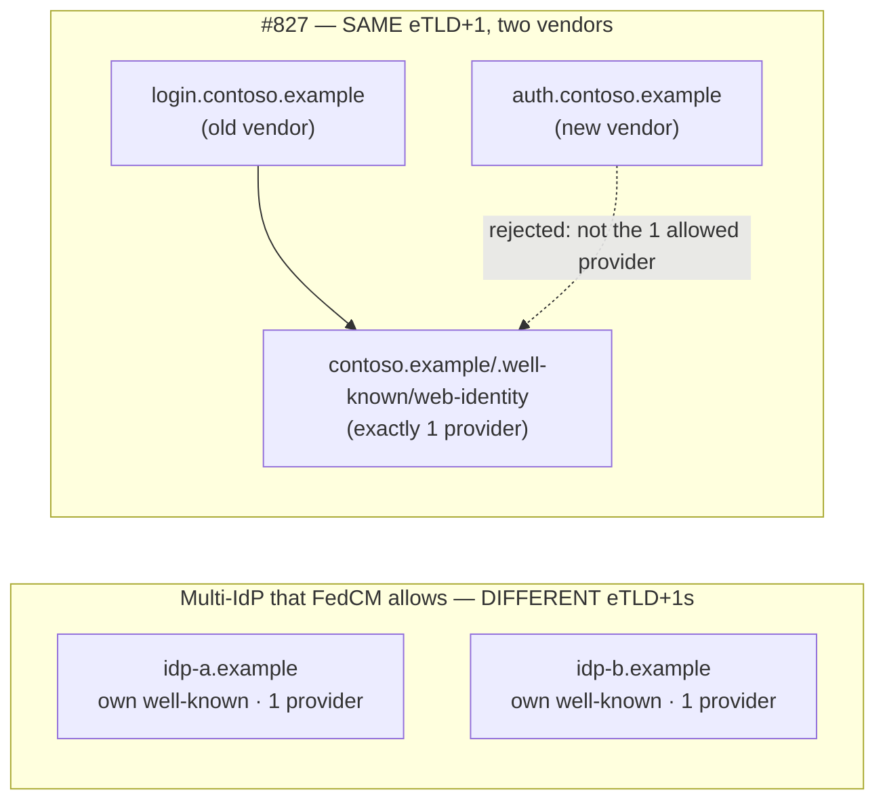
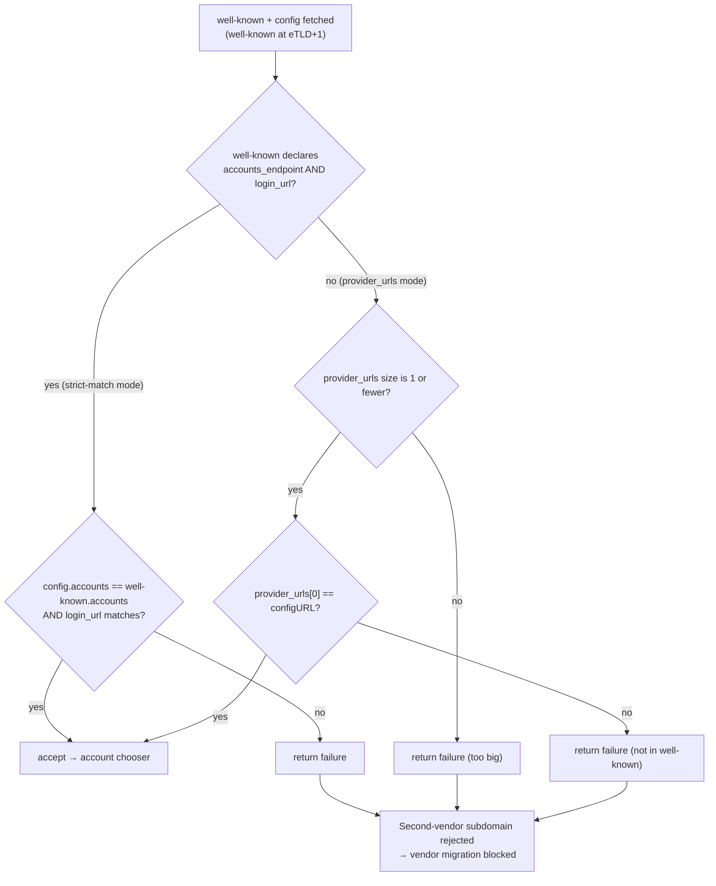
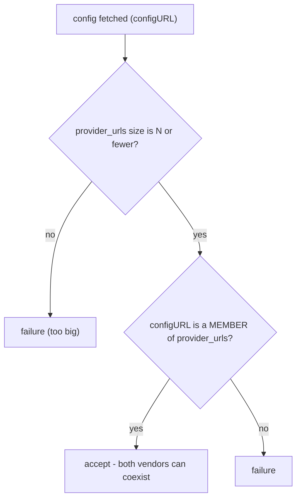

# FedCM Issue #827 — Vendor Lock-In via the Single-Provider Well-Known Constraint

**Reference:** [w3c-fedid/FedCM#827 — "FedCM facilitates vendor lock-in"](https://github.com/w3c-fedid/FedCM/issues/827)
**Related tracked issues:** [#333 (relax provider_urls size)](https://github.com/fedidcg/FedCM/issues/333), [#552 (multiple config files within an eTLD+1)](https://github.com/w3c-fedid/FedCM/issues/552)

---

## 1. The Issue — Stated Exactly

FedCM requires an Identity Provider (IdP) to expose a **single** `/.well-known/web-identity`
file at its **registrable domain (eTLD+1)**, and that file may name **exactly one** provider
(one config URL, or one `accounts_endpoint` + `login_url` pair). This makes it structurally
impossible to run **two independent FedCM IdPs on subdomains of the same registrable domain
at the same time**, which is the normal shape of a gradual **vendor-to-vendor migration**.

### Motivating real-world scenario

Companies frequently use **white-label auth vendors** (Okta, Microsoft Entra, etc.) hosted on
**CNAME'd subdomains of the company's own domain**, so the vendor's brand never appears in the
URL bar or certificate:

- Old vendor → `login.contoso.example`
- New vendor → `auth.contoso.example`

Both subdomains roll up to the same registrable domain, **`contoso.example`**.

- **With OAuth:** there is no protocol-level restriction. The company can stand up the new
  vendor on `auth.contoso.example`, keep the old vendor on `login.contoso.example`, and cut
  applications over gradually (percentage-based / canary rollout across many product apps).
- **With FedCM:** the single well-known file at `contoso.example` can point to only **one**
  accounts endpoint. The two vendors must share that one file, so only one of them can be the
  valid FedCM IdP at any moment. Parallel coexistence during migration is **blocked**.

The net effect the reporter names: **FedCM raises the switching cost between identity vendors
compared to OAuth — i.e., it facilitates vendor lock-in.**

---

## 2. Where the Spec Fails to Address It

The failure is baked into two spec facts working together.

### Fact A — The well-known dictionary cannot express more than one provider

```webidl
dictionary IdentityProviderWellKnown {
  sequence<USVString> provider_urls;   // config URLs — but capped at 1
  USVString accounts_endpoint;         // single scalar (not a list)
  USVString login_url;                 // single scalar (not a list)
};
```

- `accounts_endpoint` and `login_url` are **single scalar URLs** — you cannot list two.
- `provider_urls` is an array, but *fetch the config file* sets `wellKnown` to **failure** when
  its size is **greater than 1**. Spec semantics: *"provider_urls: A list containing exactly one
  URL."*
- *"Either `provider_urls` **or** both `accounts_endpoint` and `login_url` are required"* — you
  supply one provider description, never a set.

### Fact B — Config validation rejects any provider not named by that one well-known

Inside *fetch the config file* (well-known is fetched at the IdP's eTLD+1):

- **Check accounts and login url step** — if the well-known declares `accounts_endpoint` +
  `login_url`: require `well_known_accounts_url == accounts_url` **and**
  `well_known_login_url == login_url`, else **return failure**.
- **Otherwise** — require `provider_urls[0] == configURL`, else **return failure**.

Because the cap in Fact A is enforced **per registrable domain**, and Fact B rejects anything
the single file does not name, two IdPs under one eTLD+1 can never both validate. The one FedCM
feature that genuinely supports many IdPs — the RP-side `providers` list in
`navigator.credentials.get()` — only works because **each listed IdP lives on a *different*
eTLD+1 with its *own* well-known file**. It does not help two vendors that share a domain.

> The spec authors already flag this limitation: an inline Issue note at the size check reads
> *"relax the size of the provider_urls array"* (#333), and the changelog tracks
> #552 "Allow IDPs to use multiple config files within an eTLD+1". Issue #827 is the
> vendor-lock-in argument for actually doing so.

### Diagram — happy path vs. the #827 failure path



### Diagram — why "multi-IdP" does not rescue this



### Diagram — the exact validation branch that fails



---

## 3. Proposed Solution — Relax `provider_urls` to a Small Bounded N

Change the well-known cap from **exactly 1** to a **small bounded number** (e.g. **N = 2 or 3**)
of provider config URLs per registrable domain. During a migration the file lists both vendors:

```json
{ "provider_urls": [
    "https://login.contoso.example/fedcm.json",
    "https://auth.contoso.example/fedcm.json"
] }
```

- **Spec change:** replace the `size > 1 -> failure` rule with `size > N -> failure`, and change
  the "Otherwise" branch from checking only `provider_urls[0]` to checking **membership** of
  `configURL` in `provider_urls`.


